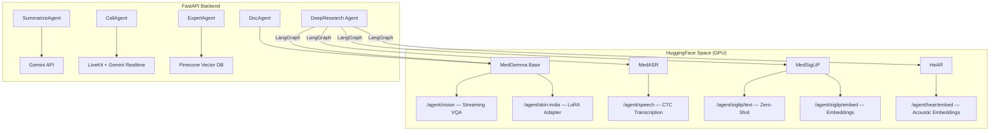

# 🏥 ArogyaNet AI — Federated Clinical Intelligence System

> **No paperwork, all data electrified.** A production-grade, AI-first healthcare backend that unifies patient management, multimodal medical AI, and real-time voice agents into a single platform.

[](https://python.org)
[](https://fastapi.tiangolo.com)
[](https://huggingface.co/spaces)
[](LICENSE)

---

## 📌 Purpose

ArogyaNet AI is designed to **bridge the gap between urban medical facilities and rural healthcare needs** through a federated system of AI agents and robust offline-first mobile solutions.

It serves hospitals, clinics, and field healthcare teams by providing:
- **AI-powered triage & appointment suggestion** — patients describe symptoms, the system recommends the right specialist
- **Medical document intelligence** — instant AI analysis of prescriptions, lab reports, and X-rays
- **Real-time voice transcription** — doctors dictate during consultations and the AI populates prescriptions
- **Autonomous follow-up calls** — an AI receptionist places outbound voice calls for reminders and check-ins
- **Offline-capable nurse fieldwork** — vitals collection and patient registration without internet, with automatic sync
- **Expert knowledge sharing** — senior doctors contribute treatment insights that junior doctors can semantically search

---

## 🧠 AI Agent Ecosystem (5 Agents)

ArogyaNet deploys **5 specialized AI agents**, each serving a distinct clinical function. Heavy model inference runs on a dedicated **HuggingFace Space** (GPU), while the FastAPI backend orchestrates lightweight API calls.

| # | Agent | Model / Service | Purpose |
|---|-------|-----------------|---------|
| 1 | **MedVQA** | `google/medgemma-1.5-4b-it` (4-bit quantized) | Medical Visual Question Answering — analyzes X-rays, CT scans, reports |
| 2 | **MedSkinIndia** | `nagireddy5/medgemma-skin-lora` (PEFT adapter) | Indian skin disease specialist optimized for Fitzpatrick III–VI skin types |
| 3 | **MedASR** | `google/medasr` | Medical speech recognition — transcribes doctor–patient consultations |
| 4 | **MedSigLIP** | `google/medsiglip-448` | Zero-shot medical image classification (Normal / Fracture / Pneumonia / Tumor / etc.) |
| 5 | **HeAR** | `google/hear` | Health Acoustic Representations — acoustic embeddings from coughs, breathing, cardiac sounds |

### Agent Architecture



---

## 🚀 Key Features

### 1. 🤖 Smart Appointment Triage (`SummarizeAgent`)
- Patient describes symptoms in plain text
- AI analyzes urgency, recommends the correct specialist, and suggests an available time slot
- Structured output: doctor, specialization, severity level, recommended slot

### 2. � Medical Document Analysis (`DocAgent`)
- Upload any medical document (PDF / lab report image / prescription photo)
- AI summarizes findings, highlights critical values, and answers follow-up questions
- Supports **streaming SSE** for real-time token-by-token display
- Chat history per appointment for continuity across consultations

### 3. 🔬 Deep Multimodal Research (`DeepAgent`)
- Accepts **image + audio + PDF** simultaneously
- Parallel fan-out processing via **LangGraph**:
  - MedVQA analyzes images
  - MedASR transcribes audio
  - HeAR generates acoustic health embeddings (anomaly detection)
  - MedSigLIP classifies images zero-shot
  - PDF text extraction
- **Tavily** web search for latest medical research
- Final synthesis by **Llama 3.3 70B** (via Groq) into a structured clinical report
- Full **SSE streaming** with real-time status updates

### 4. 🎙️ Voice-to-Records (`MedASR + VoiceAgent`)
- **WebSocket endpoint** for real-time dictation during consultations
- **File upload endpoint** for batch transcription of voice notes
- CTC blank token cleanup and duplicate word de-duplication built in
- Perfect for offline nurse visits — record audio, upload later

### 5. 📞 AI Receptionist (`CallAgent`)
- Autonomous outbound voice calls powered by **LiveKit + Gemini 2.5 Flash Native Audio**
- Use cases: vaccination reminders, post-surgery follow-ups, appointment confirmations
- Reads patient context from the database (doctor name, hospital, patient history)
- Doctor can provide custom prompts for specific questions to ask patients
- Full call transcript saved to database

### 6. 🩺 Indian Skin Disease Specialist (`MedSkinIndia`)
- Fine-tuned LoRA adapter (`nagireddy5/medgemma-skin-lora`) on Indian dermatology cases
- Optimized for Fitzpatrick III–VI skin types and tropical conditions
- Clinical assessment with differential diagnoses, recommended tests, and urgency level

### 7. 🧠 Expert Knowledge Base (`ExpertAgent`)
- Senior doctors contribute treatment protocols and clinical insights
- Stored in **Pinecone** vector database with semantic embeddings
- Hospital-specific priority: searches own hospital data first, anonymous global fallback
- Streaming expert answers via **SSE** with medication/lab test metadata

### 8. 🥗 AI Diet Planner (`DietPlannerAgent`)
- Generates personalized diet plans based on patient condition and doctor remarks
- Streamed as SSE events for real-time display
- Only accessible by doctors (role-gated)

### 9. 📑 Medical Report Summarizer (`MedicalSummarizer`)
- **Two modes:**
  - **General** — Lab reports, prescriptions, X-rays analyzed by Gemini Vision
  - **Skin Specialist** — Dermatology images routed to MedGemma + Indian Skin LoRA
- Streaming SSE output with structured clinical format

### 10. 📷 Event Data Populator (`EventDataPopulator`)
- Extracts structured key–value data from medical images using Gemini Vision
- Input: image URL + list of keys to extract
- Output: JSON object with extracted values

---

## � Role-Based Access Control

| Role | Capabilities |
|------|-------------|
| **Super Admin** | Full system access, hospital management, user provisioning |
| **Hospital Admin** | Manage doctors, nurses, patients, inventory, floors within their hospital |
| **Doctor** | Consult patients, use AI agents, prescribe, view diagnostics, trigger follow-up calls, create diet plans |
| **Nurse** | Field vitals collection (offline-capable), patient registration, appointment vitals logging |
| **Lab Assistant** | Upload lab reports, manage lab tests |
| **Patient** | Book appointments, view history, upload reports for AI explanation |

---

## 🗄️ Database Schema

Built on **SQLAlchemy 2.0** (async) with **SQLite** (dev) / **PostgreSQL** (prod).

| Model | Purpose |
|-------|---------|
| `User` | Authentication, roles, hospital association |
| `Hospital` | Multi-tenant hospital management |
| `Doctor` | Specialization, license, availability |
| `Nurse` | Field healthcare staff |
| `Patient` | Demographics, assigned doctor/nurse |
| `Appointment` | Date, slot, severity, status, remarks (JSON), diet plan |
| `AppointmentVital` | Nurse-recorded vitals per appointment |
| `AppointmentChat` | AI-generated chat history per appointment |
| `Document` | File uploads (reports, images) |
| `LabReport` | Lab report metadata and results |
| `LabTest` | Individual test definitions |
| `Medicine` | Hospital pharmacy inventory |
| `Event` | Patient events, vitals alerts |
| `Floor` | Hospital floor management |
| `Availability` | Doctor schedule slots |
| `CallScript` | AI receptionist call transcripts |
| `Specialization` | Medical specialization seeds |
| `UserMemory` | Long-term memory for personalized AI responses |

---

## 🔌 API Endpoints

### AI Agents (`/api/v1/agent`)
| Method | Endpoint | Description |
|--------|----------|-------------|
| `POST` | `/suggest-appointment` | AI-powered triage and appointment suggestion |
| `POST` | `/analyze` | Medical document analysis (streaming SSE) |
| `POST` | `/deep-research` | Multimodal deep research (streaming SSE) |
| `POST` | `/expert-check` | Store expert insight to knowledge base |
| `GET`  | `/expert-check` | Semantic search expert insights |
| `POST` | `/expert-chat` | Stream expert answer (SSE) |
| `POST` | `/diet-planner` | Generate diet plan (streaming SSE) |
| `POST` | `/summarize-medical-report` | Medical image summarization (streaming SSE) |
| `POST` | `/populate-event-data` | Extract structured data from image |
| `POST` | `/trigger-call` | Initiate AI receptionist outbound call |
| `POST` | `/hear-embed` | Generate HeAR acoustic embedding |

### Voice (`/api/v1/voice`)
| Method | Endpoint | Description |
|--------|----------|-------------|
| `WS`   | `/ws/transcribe` | Real-time WebSocket audio transcription |
| `POST` | `/transcribe` | Batch audio file transcription |

### Core CRUD (`/api/v1`)
| Resource | Endpoints |
|----------|-----------|
| Auth | `POST /auth/login`, `POST /auth/register`, `POST /auth/google` |
| Users | Full CRUD + profile management |
| Hospitals | CRUD + staff listing |
| Doctors | CRUD + availability + patient listing |
| Nurses | CRUD + assigned patients |
| Patients | CRUD + medical history + search |
| Appointments | CRUD + status updates + vitals + chat history |
| Lab Reports | CRUD + file uploads |
| Lab Tests | CRUD |
| Inventory | Medicine stock management |
| Events | Patient event tracking |
| Floors | Hospital floor management |
| Documents | File upload and retrieval |
| Search | Global search across entities |

---

## 🛠️ Tech Stack

| Layer | Technology |
|-------|-----------|
| **API Framework** | FastAPI (async, OpenAPI docs) |
| **Database** | SQLAlchemy 2.0 + aiosqlite (dev) / PostgreSQL (prod) |
| **Auth** | JWT (python-jose) + bcrypt + Google OAuth2 |
| **AI Orchestration** | LangGraph (stateful agent graphs) |
| **LLM — General** | Google Gemini (`gemini-3-flash-preview`) |
| **LLM — Synthesis** | Llama 3.3 70B via Groq |
| **Vision** | MedGemma 1.5 4B-IT (4-bit quantized) |
| **Skin LoRA** | `nagireddy5/medgemma-skin-lora` (PEFT) |
| **Speech** | Google MedASR (CTC) |
| **Image Classification** | Google MedSigLIP-448 |
| **Acoustic Health** | Google HeAR |
| **Voice Calls** | LiveKit Agents + Gemini Realtime Audio |
| **Vector DB** | Pinecone (expert knowledge) |
| **Web Research** | Tavily |
| **File Storage** | Supabase Storage |
| **Deployment** | Docker + HuggingFace Spaces (GPU inference) |

---

## ⚡ Quick Start

### Prerequisites
- Python 3.10+
- A `.env` file (copy from `.env.example`)

### Installation

```bash
# Clone the repository
git clone https://github.com/nagireddy5/life-health-crm.git
cd life-health-crm

# Create virtual environment
python -m venv venv
source venv/bin/activate  # Windows: venv\Scripts\activate

# Install dependencies
pip install -r requirements.txt

# Run the server
uvicorn app.main:app --reload
```

### Environment Variables

```env
DATABASE_URL=sqlite+aiosqlite:///./sql_app.db
SECRET_KEY=your-secret-key

# Google
GOOGLE_API_KEY=your-gemini-api-key
GOOGLE_CLIENT_ID=your-google-oauth-client-id

# AI Services
HUGGINGFACE_SPACE=https://nagireddy5-lifehealth-v1.hf.space
HUGGINGFACE_API_KEY=your-hf-token
GROQ_API_KEY=your-groq-api-key
TAVILY_API_KEY=your-tavily-key
PINECONE_API_KEY=your-pinecone-key

# Storage
SUPABASE_URL=your-supabase-url
SUPABASE_KEY=your-supabase-key

# Voice Agent
LIVEKIT_URL=your-livekit-url
LIVEKIT_API_KEY=your-livekit-key
LIVEKIT_API_SECRET=your-livekit-secret
```

### Docker

```bash
docker build -t arogyanet-backend .
docker run -p 7860:7860 --env-file .env arogyanet-backend
```

---

## 📂 Project Structure

```
life_health_crm/
├── app/
│   ├── main.py                    # FastAPI app + lifespan (seed data, AI init)
│   ├── api/                       # Route handlers
│   │   ├── agent.py               # AI agent endpoints (deep research, expert, diet, etc.)
│   │   ├── appointments.py        # Appointment CRUD + status management
│   │   ├── auth.py                # JWT + Google OAuth authentication
│   │   ├── voice.py               # WebSocket + file transcription
│   │   ├── chat.py                # Doctor–patient messaging
│   │   ├── doctors.py             # Doctor management + availability
│   │   ├── patients.py            # Patient CRUD + search
│   │   ├── inventory.py           # Medicine stock management
│   │   └── ...                    # hospitals, nurses, labs, events, floors, etc.
│   ├── agent/                     # AI Agent implementations
│   │   ├── LLM/llm.py            # HF Space client wrappers (MedVQA, MedASR, SigLIP, HeAR)
│   │   ├── deepAgent.py           # LangGraph multimodal research pipeline
│   │   ├── docAgent.py            # Document analysis agent
│   │   ├── summarizeAgent.py      # Appointment triage agent
│   │   ├── callAgent.py           # LiveKit AI receptionist
│   │   ├── ExpAgent.py            # Expert knowledge base (Pinecone)
│   │   ├── dietPlannerAgent.py    # Diet plan generator
│   │   ├── medicalSummarizer.py   # Medical report summarizer
│   │   ├── eventDataPopulator.py  # Structured data extraction from images
│   │   └── voiceAgent.py          # Audio transcription wrapper
│   ├── models/                    # SQLAlchemy ORM models (20 tables)
│   ├── schemas/                   # Pydantic request/response schemas
│   ├── crud/                      # Database operations
│   ├── core/                      # Config, database, security
│   └── utils/                     # PDF extraction, voice triggers
├── Dockerfile
├── requirements.txt
└── .env.example
```

---

## 🏗️ HuggingFace Space (GPU Inference Server)

The heavy AI models run on a dedicated HuggingFace Space with GPU. The FastAPI backend communicates with it via HTTP.

**Space Endpoints:**

| Endpoint | Model | Type |
|----------|-------|------|
| `POST /agent/vision` | MedGemma 1.5 4B-IT | Streaming text |
| `POST /agent/skin-india` | MedGemma + Skin LoRA | Streaming text |
| `POST /agent/speech` | MedASR | JSON response |
| `POST /agent/siglip/text` | MedSigLIP | JSON response |
| `POST /agent/siglip/embed` | MedSigLIP | JSON response |
| `POST /agent/hear/embed` | HeAR | JSON response |

---

## 📜 License

This project is licensed under the MIT License. See [LICENSE](LICENSE) for details.

---

<p align="center">
  <b>Built with ❤️ for accessible healthcare</b><br>
  <i>Powered by MedGemma • MedASR • HeAR • MedSigLIP • Gemini • Llama 3.3 • LiveKit</i>
</p>
